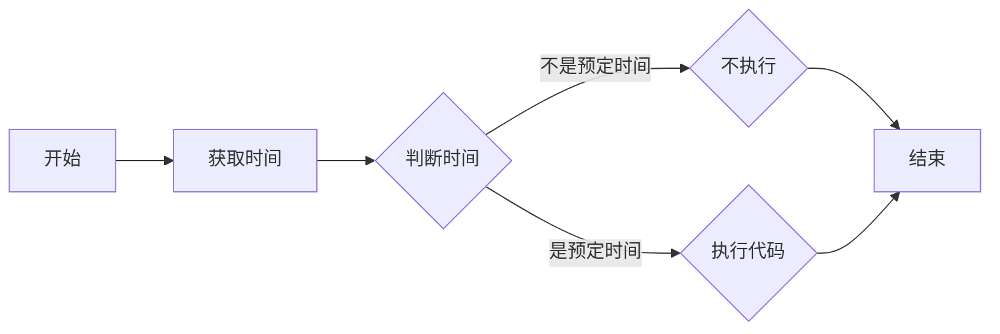

今天突然想起之前看过一篇用js来实现网站定时变黑白的

但是我找不到地址了

那好，我自己写个呗（

---

## 参考网站

谁知道我参考了多少内容

https://www.cnblogs.com/randomlee/p/9720936.html

https://zhidao.baidu.com/question/363980343569682412.html

https://www.yunecs.cn/article/1041.html

https://www.jb51.net/article/51551.htm

还有些我找不到了（

---

## 运行思路

~~原本是不想写这个的，但想了下还是写出来~~



ok，那就开始吧

~~代码写得真渣，请不要打我~~

---

## 获取时间

获取时间这个我真的...

首先，来获取个时间（应该是这么解释吧），此处不一定要是obj，其他的也行，只要把下面的一起改了就是

````js
var obj=new Date();
````

然后呢......获取月份和天啊

````js
var month=obj.getMonth();
var day=obj.getDate();
````

是的没错就这么简单（

当然为了方便调试我就顺便加上一行`console.log(year,month,day);`

---

## 判断时间并执行

嘛接下来就是判断时间了

这里用到的是if语句

一般网站变黑是4月4来着对吧，那if那应该是这么写

````js
if (month == 3 && day == 4 )
````

啊注意下，因为获取的月份是0~11的，所以要自行-1

下面就是执行了，我这用document.write()

````js
document.write('<style>html{-webkit-filter:grayscale(100%);-moz-filter:grayscale(100%);-ms-filter:grayscale(100%);-o-filter:grayscale(100%);filter:progid:DXImageTransform.Microsoft.BasicImage(grayscale=1);_filter:none}</style>')
````

当然在这下面你也可以继续写的

为了保险起见，我这顺便写了else的（

````js
} else {
	console.log('一切早就确定下来了，无法修改')
}
````

对的就这么简单

---

## 多点判断

你会想“欸我不止要这个时间来让我的网站变黑白，还有其他办法吗”

有，直接在if那加`||`然后写条件就行了

例如我的是这样的

````js
if (month == 3 && day == 4 || month == 11 && day == 13)
````

~~不要问我为什么不在if里再套if，因为我试过不知道为什么会出错~~

---

## 最终代码

我贴下我自己的供大家一起参考

````html
 <script type="text/javascript">
   var obj=new Date();
   var year=obj.getFullYear();
   var month=obj.getMonth();
   var day=obj.getDate();
   console.log(year,month,day);
   if (month == 3 && day == 4 || month == 11 && day == 13) {
     document.write('<style>html{-webkit-filter:grayscale(100%);-moz-filter:grayscale(100%);-ms-filter:grayscale(100%);-o-filter:grayscale(100%);filter:progid:DXImageTransform.Microsoft.BasicImage(grayscale=1);_filter:none}</style>')
     console.log('默哀...')
    } else {
      console.log('一切早就确定下来了，无法修改')
    }
 </script>
````

如果是用Hexo的话直接在主题文件里找到head.ejs打开编辑就是了

---

## 后话

我也不知道是不是藏得太深还是什么

我没找到这种的教程

那我去bilibili和知乎那找一找？

如果没找到的话那...(坏笑)

~~嘛写这东西来实现这功能其实是我懒得自己到时再编辑了w~~

~~又水了一篇文章了草~~